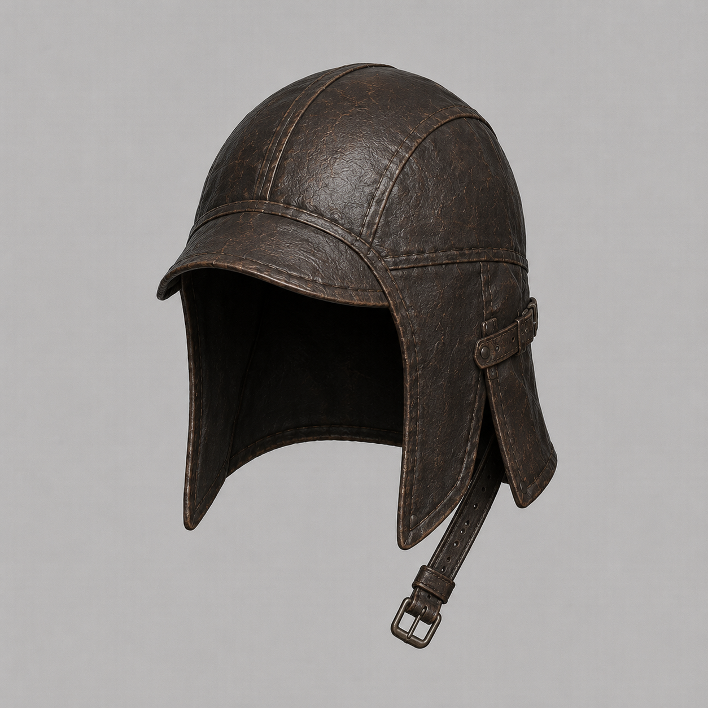
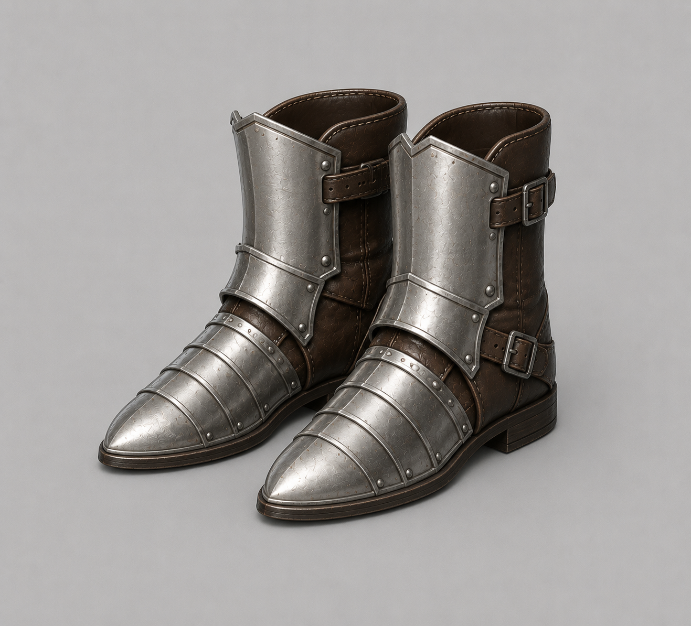
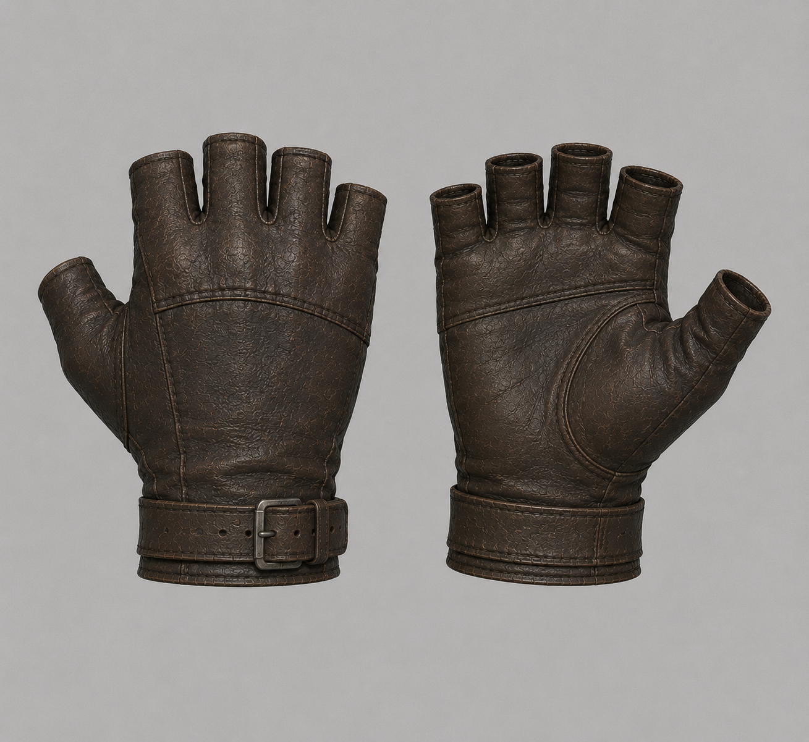
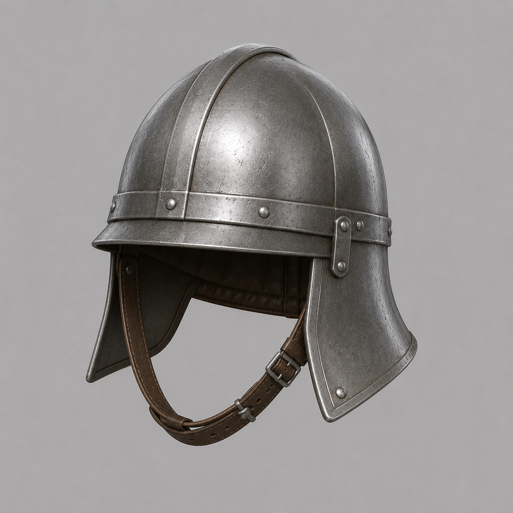
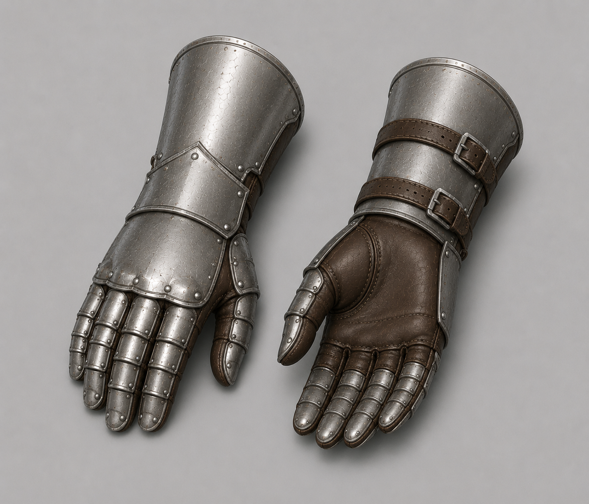
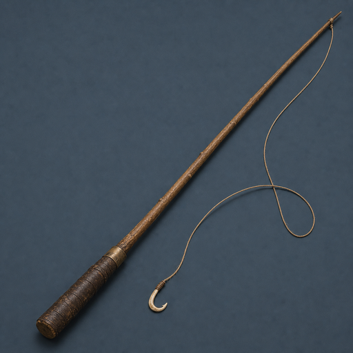

# Item Assets

- sword.glb https://www.fab.com/listings/5fe82d66-eaac-48e0-899d-1fedacdf409a
- spear.glb https://sketchfab.com/3d-models/spear-f13ddd24e2fe47aa8aca23487afd893e
- torch.glb https://sketchfab.com/3d-models/torch-stick-d8eadee1a5c14483aade99b1fe5bc150
- goblin_sword.glb https://sketchfab.com/3d-models/goblin-sword-5717ea55e34341b79efa692517e8598b
- shield_wooden.glb, shield_raven.glb https://sketchfab.com/3d-models/shield-323dfe4dbb764c439bcc6b0469f812eb
- leather_armor.glb — Meshy.ai (유료 생성, 2026-07-24, "Shadowbound Leather A"). 완전 소유권·상업 OK (characters.md License 참조)
    - 원화는 chatgpt 
- leather_pants.glb — Meshy.ai (유료 생성, 2026-07-24, "Leather Combat Pants"). 완전 소유권·상업 OK (characters.md License 참조)
    - 원화는 chatgpt 
- leather_helmet.glb — Meshy.ai (유료 생성, 2026-07-28, "Leather War Helmet"). 완전 소유권·상업 OK (characters.md License 참조). FBX를 Blender로 임포트해 0.36배 스케일 적용(폭 0.24m), 원점=바닥 중심, 텍스처 512²로 축소, 검은 emissive 제거 (2026-07-29)
    - 원화는 chatgpt 
- plate_armor.glb — Meshy.ai (유료 생성, 2026-07-29, "Steelbound Plate Armor"). 완전 소유권·상업 OK (characters.md License 참조). FBX를 Blender로 임포트해 0.6배 스케일 적용(높이 0.6m, leather_armor와 동일), 원점=바닥 중심, 텍스처 512²로 축소, 검은 emissive 제거. 아이콘은 Cycles 직교 렌더(약간 측면·위) 512²→128² (2026-07-31 재렌더)
    - Breastplate 원화는 ChatGPT 이미지 생성 (2026-07-29, contributor-owned account, tier 미기재) 
- iron_boots.glb — Meshy.ai (유료 생성, 2026-07-30, "Medieval Sabatons"). 완전 소유권·상업 OK (characters.md License 참조). FBX를 Blender로 임포트해 0.35배 스케일 적용(한 쌍 폭 0.35m, 높이 0.28m), 원점=바닥 중심, 텍스처 512²로 축소, 검은 emissive 제거 (2026-07-30)
    - 원화는 chatgpt 
- leather_gloves.glb — Meshy.ai (유료 생성, 2026-07-31, "Dark Brown Leather Fingerless Gloves"). 완전 소유권·상업 OK (characters.md License 참조). FBX를 Blender로 임포트해 0.35배 스케일 적용(한 쌍 폭 0.35m, 높이 0.21m), 원점=바닥 중심, 텍스처 512²로 축소, 검은 emissive 제거. 아이콘은 Cycles 직교 렌더(약간 측면·위) 512²→128² (2026-07-31)
    - 원화는 chatgpt 
- leather_boots.glb — Meshy.ai (유료 생성, 2026-07-31, "Crisscrossed Leather"). 완전 소유권·상업 OK (characters.md License 참조). FBX를 Blender로 임포트해 0.42배 스케일 적용(한 쌍 폭 0.35m, 높이 0.42m), 원점=바닥 중심, 텍스처 512²로 축소, 검은 emissive 제거. 아이콘은 Cycles 직교 측면·위 각도 렌더 512²→128² (2026-07-31)
    - 원화는 chatgpt 
- iron_helmet.glb — Meshy.ai (유료 생성, 2026-07-31, "Medieval Great Helmet"). 완전 소유권·상업 OK (characters.md License 참조). FBX를 Blender로 임포트해 0.3배 스케일 적용(폭 0.25m, 높이 0.29m), 원점=바닥 중심, 텍스처 512²로 축소, 검은 emissive 제거. 아이콘은 Cycles 직교 측면·위 각도 렌더 512²→128² (2026-07-31)
    - 원화는 chatgpt 
- iron_gauntlets.glb — Meshy.ai (유료 생성, 2026-07-31, "Twin Iron Gauntlets"). 완전 소유권·상업 OK (characters.md License 참조). FBX를 Blender로 임포트해 0.35배 스케일 적용(한 쌍 폭 0.35m, 높이 0.30m), 원점=바닥 중심, 텍스처 512²로 축소, 검은 emissive 제거. 아이콘은 Cycles 측면·위 직교 렌더 512²→128² (2026-07-31)
    - 원화는 chatgpt 
- fishing_rod.glb — Meshy.ai (유료 생성, 2026-07-26, image-to-3D from the archived concept render). 완전 소유권·상업 OK (characters.md License 참조). Textures downscaled to 512², transform matched to spear.glb's hand-socket convention, `rod_tip` empty baked at the tip (script, 2026-07-28)
    - 원화는 chatgpt 
- Fishing icons (10): fishing_rod.png, raw_minnow.png, raw_perch.png, raw_trout.png, river_salmon.png, golden_sturgeon.png, old_boot.png, clump_of_kelp.png, message_in_a_bottle.png, sunken_coin_pouch.png — ChatGPT image generation (2026-07-25, contributor-owned account), concept renders cut to 128×128 transparent icons
    - 원화: [rod](../images/fishing_rod.png) · [minnow](../images/raw_minnow.png) · [perch](../images/raw_perch.png) · [trout](../images/raw_trout.png) · [salmon](../images/river_salmon.png) · [sturgeon](../images/golden_sturgeon.png) · [boot](../images/old_boot.png) · [kelp](../images/clump_of_kelp.png) · [bottle](../images/message_in_a_bottle.png) · [pouch](../images/sunken_coin_pouch.png)
