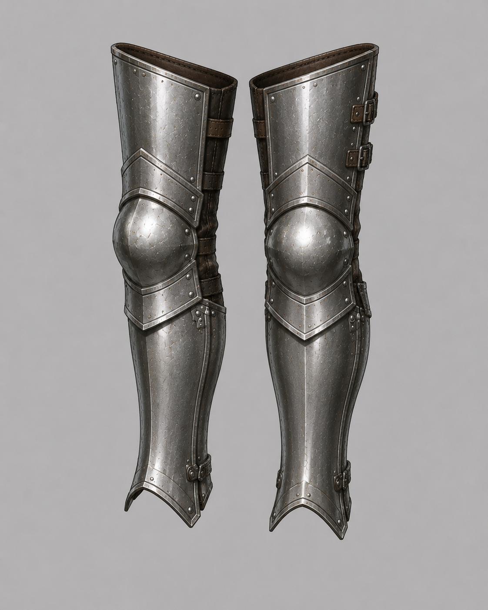
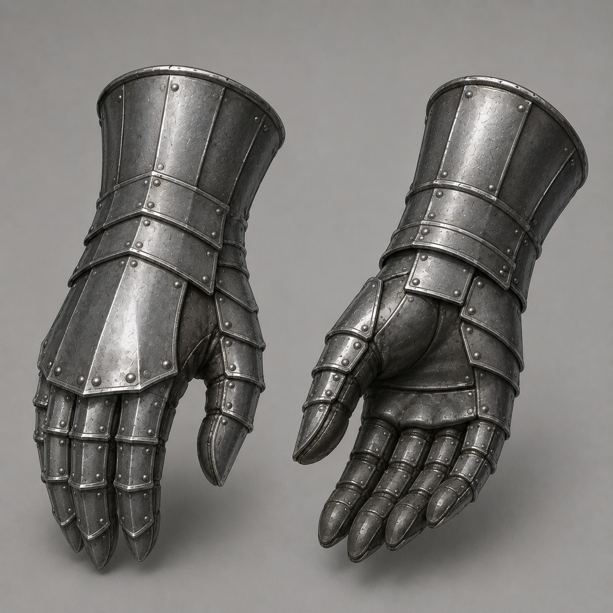
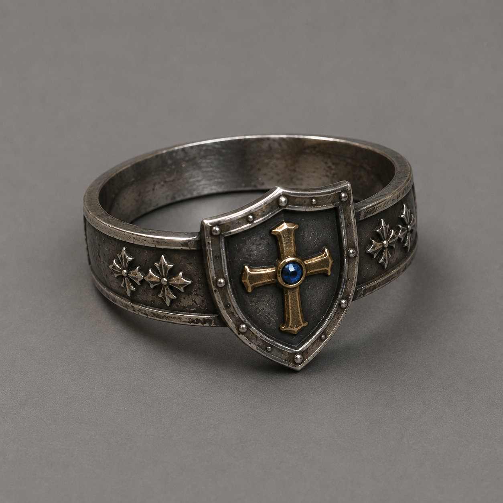
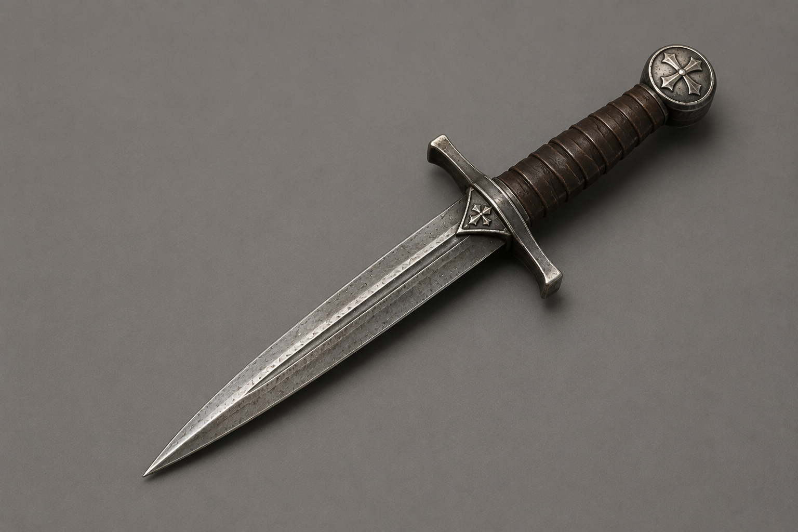

# Item Assets

- traveler_robe.svg, padded_battle_robe.svg, brigandine_coat.svg — original
  SVG icons authored for OpenMMO by OpenAI Codex (2026-08-02); project-owned,
  no third-party source or license dependency. These items intentionally use
  icon billboards on the ground until dedicated 3D and wearable meshes ship.

- repair_kit.svg — original SVG icon authored for OpenMMO by OpenAI Codex
  (Codex workspace entitlement; exact account tier unavailable to the tool;
  2026-08-02); project-owned, no third-party source or license dependency. The
  Cloth, Leather, Metal, and Hybrid Repair Kit definitions intentionally share
  this generic maintenance icon; their authored names, materials, and repair
  families distinguish them.

- sword.glb https://www.fab.com/listings/5fe82d66-eaac-48e0-899d-1fedacdf409a
- spear.glb https://sketchfab.com/3d-models/spear-f13ddd24e2fe47aa8aca23487afd893e
- torch.glb https://sketchfab.com/3d-models/torch-stick-d8eadee1a5c14483aade99b1fe5bc150
- goblin_sword.glb https://sketchfab.com/3d-models/goblin-sword-5717ea55e34341b79efa692517e8598b
- shield_wooden.glb, shield_raven.glb https://sketchfab.com/3d-models/shield-323dfe4dbb764c439bcc6b0469f812eb
- leather_armor.glb — Meshy.ai (유료 생성, 2026-07-24, "Shadowbound Leather A"). 완전 소유권·상업 OK (characters.md License 참조)
    - 원화는 chatgpt 
- leather_pants.glb — Meshy.ai (유료 생성, 2026-07-24, "Leather Combat Pants"). 완전 소유권·상업 OK (characters.md License 참조)
    - 원화는 chatgpt 
- leather_helmet.glb — Meshy.ai (유료 생성, 2026-07-28, "Leather War Helmet"). 완전 소유권·상업 OK (characters.md License 참조). FBX를 Blender로 임포트해 0.36배 스케일 적용(폭 0.24m), 원점=바닥 중심, 텍스처 512²로 축소, 검은 emissive 제거 (2026-07-29)
    - 원화는 chatgpt 
- plate_armor.glb — Meshy.ai (유료 생성, 2026-07-29, "Steelbound Plate Armor"). 완전 소유권·상업 OK (characters.md License 참조). FBX를 Blender로 임포트해 0.6배 스케일 적용(높이 0.6m, leather_armor와 동일), 원점=바닥 중심, 텍스처 512²로 축소, 검은 emissive 제거. 아이콘은 Cycles 직교 렌더(약간 측면·위) 512²→128² (2026-07-31 재렌더)
    - Breastplate 원화는 ChatGPT 이미지 생성 (2026-07-29, contributor-owned account, tier 미기재) 
- iron_boots.glb — Meshy.ai (유료 생성, 2026-07-30, "Medieval Sabatons"). 완전 소유권·상업 OK (characters.md License 참조). FBX를 Blender로 임포트해 0.35배 스케일 적용(한 쌍 폭 0.35m, 높이 0.28m), 원점=바닥 중심, 텍스처 512²로 축소, 검은 emissive 제거 (2026-07-30)
    - 원화는 chatgpt 
- leather_gloves.glb — Meshy.ai (유료 생성, 2026-07-31, "Dark Brown Leather Fingerless Gloves"). 완전 소유권·상업 OK (characters.md License 참조). FBX를 Blender로 임포트해 0.35배 스케일 적용(한 쌍 폭 0.35m, 높이 0.21m), 원점=바닥 중심, 텍스처 512²로 축소, 검은 emissive 제거. 아이콘은 Cycles 직교 렌더(약간 측면·위) 512²→128² (2026-07-31)
    - 원화는 chatgpt 
- leather_boots.glb — Meshy.ai (유료 생성, 2026-07-31, "Crisscrossed Leather"). 완전 소유권·상업 OK (characters.md License 참조). FBX를 Blender로 임포트해 0.42배 스케일 적용(한 쌍 폭 0.35m, 높이 0.42m), 원점=바닥 중심, 텍스처 512²로 축소, 검은 emissive 제거. 아이콘은 Cycles 직교 측면·위 각도 렌더 512²→128² (2026-07-31)
    - 원화는 chatgpt 
- iron_helmet.glb — Meshy.ai (유료 생성, 2026-07-31, "Medieval Great Helmet"). 완전 소유권·상업 OK (characters.md License 참조). FBX를 Blender로 임포트해 0.3배 스케일 적용(폭 0.25m, 높이 0.29m), 원점=바닥 중심, 텍스처 512²로 축소, 검은 emissive 제거. 아이콘은 Cycles 직교 측면·위 각도 렌더 512²→128² (2026-07-31)
    - 원화는 chatgpt 
- iron_gauntlets.glb — Meshy.ai (유료 생성, 2026-07-31, "Twin Iron Gauntlets"). 완전 소유권·상업 OK (characters.md License 참조). FBX를 Blender로 임포트해 0.35배 스케일 적용(한 쌍 폭 0.35m, 높이 0.30m), 원점=바닥 중심, 텍스처 512²로 축소, 검은 emissive 제거. 아이콘은 Cycles 측면·위 직교 렌더 512²→128² (2026-07-31)
    - 원화는 chatgpt 
- chain_mail.glb — Meshy.ai (유료 생성, 2026-08-01, "Leather Trimmed Chain"). 완전 소유권·상업 OK (characters.md License 참조). FBX를 Blender로 임포트해 0.6배 스케일 적용(높이 0.6m), X축 −90° 회전으로 눕힌 자세(가슴이 위, 바닥면 0.53×0.6m), 원점=바닥 중심, 텍스처 512²로 축소, 검은 emissive 제거. 아이콘은 Cycles 직교 측면·위 각도 렌더 512²→128² (2026-08-01)
    - 원화는 chatgpt 
- iron_leggings.glb — Meshy.ai (유료 생성, 2026-08-01, "Knight's Leg Armor"). 완전 소유권·상업 OK (characters.md License 참조). FBX를 Blender로 임포트해 높이 0.7m로 스케일, X축 −90° 회전으로 등을 바닥에 대고 눕힘(0.33×0.70×0.36m), 원점=바닥 중심, 텍스처 512²로 축소, 검은 emissive 제거. 아이콘은 Cycles 직교 측면·위 각도 렌더(서 있는 자세) 512²→128² (2026-08-01)
    - 원화는 chatgpt 
- plate_greaves.glb — Meshy.ai (유료 생성, 2026-08-01, "Twin Steel Greaves"). 완전 소유권·상업 OK (characters.md License 참조). FBX를 Blender로 임포트해 높이 0.45m로 스케일 적용(한 쌍 0.37×0.36×0.45m, 발 포함 서 있는 자세), 원점=바닥 중심, 텍스처 512²로 축소, 검은 emissive 제거. 아이콘은 Cycles 직교 측면·위 각도 렌더 512²→128² (2026-08-01)
    - 원화는 chatgpt 
- plate_helmet.glb — Meshy.ai (유료 생성, 2026-08-01, "Iron Sentinel" 클로즈 헬름). 완전 소유권·상업 OK (characters.md License 참조). FBX를 Blender로 임포트해 높이 0.3m로 스케일 적용(0.20×0.29×0.30m), 원점=바닥 중심, 텍스처 512²로 축소, 검은 emissive 제거. 아이콘은 Cycles 직교 측면·위 각도 렌더 512²→128² (2026-08-02)
    - 원화는 chatgpt 
- plate_gauntlets.glb — Meshy.ai (유료 생성, 2026-08-01, "Ironclad Gauntlets"). 완전 소유권·상업 OK (characters.md License 참조). FBX를 Blender로 임포트해 한 쌍 폭 0.35m로 스케일 적용, X축 −70° 회전으로 손등 갑주가 위를 향하게 눕힘(커프 20° 들림, 0.35×0.32×0.15m), 원점=바닥 중심, 텍스처 512²로 축소, 검은 emissive 제거. 아이콘은 Cycles 직교 측면·위 각도 렌더(서 있는 자세) 512²→128² (2026-08-02)
    - 원화는 chatgpt 
- cross_shield_ring.glb — Meshy.ai (유료 생성, 2026-08-01, "Medieval Cross Shield" — 실제로는 방패 문양 반지). 완전 소유권·상업 OK (characters.md License 참조). FBX를 Blender로 임포트해 0.3배 스케일 적용(외경 0.3m, 높이 0.14m — 실물 반지는 너무 작아 보이지 않아 확대), 원점=바닥 중심, 텍스처 512²로 축소, 검은 emissive 제거. 아이콘은 Cycles 직교 측면·위 각도 렌더 512²→128² (2026-08-02)
    - 원화는 chatgpt 
- dagger.glb — Meshy.ai (유료 생성, 2026-08-02, "Crusader's Dagger"). 완전 소유권·상업 OK (characters.md License 참조). FBX를 Blender로 임포트해 0.42배 스케일 적용(전장 0.42m, small_sword 0.54m보다 작게), sword.glb 규약에 맞춰 칼날 +X·칼날 평면 XZ·원점=그립, 텍스처 512²로 축소, 검은 emissive 제거. 아이콘은 Cycles 직교 측면·위 각도 렌더(대각선 구도) 512²→128² (2026-08-02)
    - 원화는 chatgpt 
- ornate_cross_belt.glb — Meshy.ai (유료 생성, 2026-08-02, "Ornate Cross Belt"). 완전 소유권·상업 OK (characters.md License 참조). FBX를 Blender로 임포트해 0.4배 스케일 적용(직경 0.4m, 높이 0.15m), 원점=바닥 중심, 텍스처 512²로 축소, 검은 emissive 제거. 아이콘은 Cycles 직교 측면·위 각도 렌더 512²→128² (2026-08-02)
    - 원화는 chatgpt 
- apple.glb — Meshy AI "Crimson Apple with Leaf" (Pro 요금제, 2026-08-03 생성). 지름 0.15m로 스케일 적용, 원점을 바닥 중앙으로 이동. 텍스처 2048→512 축소, metallic/emissive 맵은 값이 거의 0이라 제거하고 metallicFactor=0. `client/public/items/apple.png` 아이콘은 이 모델을 128x128로 렌더링한 것
    - 원화는 ChatGPT 이미지 생성 (ChatGPT Pro 20x, 2026-08-03) 
- bread.glb — Meshy.ai (유료 생성, 2026-08-03, "Crusty Loaf of Bread"). 완전 소유권·상업 OK (characters.md License 참조). FBX를 Blender로 임포트해 길이 0.28m로 스케일 적용(0.28×0.14×0.14m, 사과보다 크게), 원점=바닥 중심, 텍스처 512²로 축소, 검은 emissive 제거. 아이콘은 Cycles 직교 측면·위 각도 렌더 512²→128² (2026-08-04)
    - 원화는 ChatGPT 이미지 생성 (ChatGPT Pro 20x, 2026-08-04) 
- cheese_wedge.glb — Meshy.ai (유료 생성, 2026-08-03, "Swiss cheese wedge"). 완전 소유권·상업 OK (characters.md License 참조). GLB를 Blender로 임포트해 밑면 0.15m로 스케일 적용(0.15×0.15×0.08m, bread.glb의 절반 길이), 원점=바닥 중심, 텍스처 512²로 축소, 검은 emissive 제거. 아이콘은 Cycles 직교 측면·위 각도 렌더 512²→128² (2026-08-04)
    - 원화는 ChatGPT 이미지 생성 (ChatGPT Pro 20x, 2026-08-04) 
- jerky.glb — Meshy.ai (유료 생성, 2026-08-03, "Beef Jerky Strips"). 완전 소유권·상업 OK (characters.md License 참조). GLB를 Blender로 임포트해 바닥 면적 0.16m로 스케일 적용(0.16×0.16×0.05m, 사과와 같은 급이지만 납작한 무더기), 원점=바닥 중심, 텍스처 512²로 축소, 검은 emissive 제거. 아이콘은 Cycles 직교 측면·위 각도 렌더 512²→128², 2026-08-02 프로시저럴 플레이스홀더를 교체 (2026-08-04)
    - 원화는 ChatGPT 이미지 생성 (ChatGPT Pro 20x, 2026-08-04) 
- lembas_wafer.glb (람바스 와퍼) — Meshy.ai (유료 생성, 2026-08-04, "Banana Leaf Wrapped T…" — 파일명에서 잘림). 완전 소유권·상업 OK (characters.md License 참조). GLB를 Blender로 임포트해 긴 축 0.28m로 스케일 적용(0.28×0.07×0.26m, bread.glb와 같은 길이의 납작한 꾸러미 — 잎으로 싸 끈으로 묶은 한 덩이 + 낱개 웨이퍼 한 장 구성), 원점=바닥 중심, 텍스처 512²로 축소, 검은 emissive 제거. 아이콘은 Cycles 직교 측면·위 각도 렌더 512²→128² (2026-08-04). items.csv 등록 + Rica 카탈로그 판매
    - 원화는 ChatGPT 이미지 생성 (ChatGPT Pro 20x, 2026-08-04) 
- fishing_rod.glb — Meshy.ai (유료 생성, 2026-07-26, image-to-3D from the archived concept render). 완전 소유권·상업 OK (characters.md License 참조). Textures downscaled to 512², transform matched to spear.glb's hand-socket convention, `rod_tip` empty baked at the tip (script, 2026-07-28)
    - 원화는 chatgpt 
- Fishing icons (10): fishing_rod.png, raw_minnow.png, raw_perch.png, raw_trout.png, river_salmon.png, golden_sturgeon.png, old_boot.png, clump_of_kelp.png, message_in_a_bottle.png, sunken_coin_pouch.png — ChatGPT image generation (2026-07-25, contributor-owned account), concept renders cut to 128×128 transparent icons
    - 원화: [rod](../images/fishing_rod.png) · [minnow](../images/raw_minnow.png) · [perch](../images/raw_perch.png) · [trout](../images/raw_trout.png) · [salmon](../images/river_salmon.png) · [sturgeon](../images/golden_sturgeon.png) · [boot](../images/old_boot.png) · [kelp](../images/clump_of_kelp.png) · [bottle](../images/message_in_a_bottle.png) · [pouch](../images/sunken_coin_pouch.png)
- scroll_of_party_summon.png — scroll_of_return.png의 hue-rotation 파생 (스크립트, 2026-07-31): 붉은 봉인·장식 → 보라. 3D는 기존 scroll.glb 재사용
- Hunger icons — 자체 제작 프로시저럴 플레이스홀더 (PIL 스크립트, 2026-08-02, 512² 드로잉→128² 다운스케일, 라이선스 문제 없음). 처음 9개를 만들었고, 남은 플레이스홀더는 grilled_minnow.png, grilled_perch.png, grilled_trout.png, grilled_salmon.png, grilled_sturgeon.png 5개다. 기존 ChatGPT 아이콘 스타일과 다르므로 추후 AI 아이콘으로 교체 예정
    - 교체 완료: apple.png(2026-08-03), bread.png·jerky.png(2026-08-04) — 각 모델의 Cycles 렌더. cheese.png는 cheese_wedge.png로 대체되고 삭제됨
- campfire_kit.glb — Meshy.ai (유료 생성, 2026-08-03, "Firewood Bundle"). 완전 소유권·상업 OK (characters.md License 참조). FBX를 Blender로 임포트해 0.45배 스케일 적용(장작 길이 0.45m, 0.45×0.45×0.30m 눕힌 자세), 원점=바닥 중심, 텍스처 512²로 축소, 검은 emissive 제거. 아이콘 campfire_kit.png는 Cycles 직교 측면·위 각도 렌더 512²→128², 2026-08-02 프로시저럴 플레이스홀더를 교체 (2026-08-03)
    - 원화는 ChatGPT 이미지 생성 (ChatGPT Pro 20x, 2026-08-03) 
