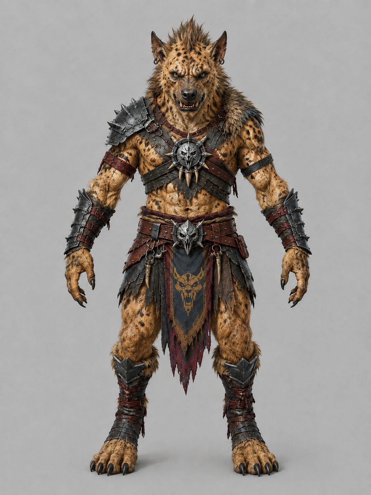

# Monster Assets

## Monster

- SCP939 https://sketchfab.com/3d-models/scp939-79a749a5073b453d9d85875797bf45d7
- Orc https://create.verse8.io/ 에서 2d -> 3d 생성함
  - 원화는 chatgpt.com에서 다음 프롬프트로 생성함

    > T-pose, fantasy concept art of an orc warrior, muscular humanoid with greyish-green leathery skin, protruding lower tusks, heavy brow ridge, pointed ears, battle-scarred face, crude iron and bone armor, tribal war paint, dramatic rim lighting, dark earthy color palette, detailed character design sheet, painterly digital art, D&D fantasy aesthetic, highly detailed, 4k

    > change it to simple background, character only, no texts

    > make the background light grey

    > make his skin more green

    
- female orc https://create.verse8.io/ 에서 2d -> 3d 생성함; 원화는 chatgpt.com에서 생성 
- goblin https://create.verse8.io/ 에서 2d -> 3d 생성함; 원화는 chatgpt.com에서 생성 
- hobgoblin Meshy.ai (유료 생성, 2026-08-14, "Ironclad Warlord") 에서 2d -> 3d 생성 후
  mixamo.com에서 auto-rig (65본). 원화는 chatgpt.com에서 생성 
  - Blender: Mixamo FBX가 metallic=1 / specular 2배로 들어와 검은 크롬처럼 보이므로 되돌리고,
    텍스처는 Mixamo FBX에 임베드된 PNG(2048², 1024²·JPEG q88로 export)로 재연결. 본 이름의 `mixamorig:` 접두사를 떼어
    캐릭터 리그(knight.glb) 규약에 맞춤. 높이 1.90m(사람 크기)로 스케일 적용, 원점=바닥 중심,
    `export_yup=True`로 GLB export. 작업 blend는 `~/assets_original/hobgoblin.blend`
  - 소스는 `assets/`의 Mixamo FBX 하나만 보관한다. Meshy obj zip은 리깅 없는 메시 + 동일한 PNG라 삭제 (2026-08-15)
  - Meshy가 베이스 컬러만 주므로 metallic-roughness 맵은 albedo의 채도·명도에서 유도해 만들었다
    (어둡고 무채색인 판금 → metallic 0.85 / roughness 0.54, 피부는 metallic 0 / roughness 0.92). 정확한 PBR이
    필요하면 Meshy에서 PBR 맵 세트를 다시 받아 교체할 것
  - 애니메이션 클립 미탑재 — 캐릭터 공용 팩(locomotion/combat_melee)을 런타임에 리타게팅해서 쓴다
    (`monsters.csv`의 `sharedAnims` → `loadSharedPackClipsForModel`, 모델당 1회 캐시).
    팩의 리그(Medea, 힙 1.0m)와 몬스터 리그의 비율이 달라 그대로 재생하면 팔다리가 늘어난다.
    리타게팅은 힙을 소스 리그 기준으로 잡아 몸이 지면에 파묻히므로(dying이 12cm) 클립마다
    가장 깊이 잠기는 프레임만큼 힙 트랙을 올려 접지시킨다 (`groundRetargetedClips`).
    공용 팩에는 hit 리액션이 없어 `animHit`은 비워 둠
- gnoll Meshy.ai (유료 생성, 2026-08-15, "Hyena Warlord") 에서 2d -> 3d 생성 후
  mixamo.com에서 auto-rig (57본, 새끼손가락 없음). 원화는 chatgpt.com에서 생성 
  - hobgoblin과 같은 Blender 파이프라인(Mixamo 재질 되돌리기, `mixamorig:` 접두사 제거, albedo에서 유도한
    metallic-roughness 맵, 1024²·JPEG q88, `export_yup=True`). 높이 2.15m — D&D 놀은 7~7.5ft로 사람보다 크다.
    Meshy 원본이 1cm 크기로 들어와 mesh/armature data를 직접 스케일했다. 작업 blend는 `~/assets_original/gnoll.blend`
  - 소스는 `assets/`의 Mixamo FBX 하나만 보관한다
- kobold https://create.verse8.io/ 에서 2d -> 3d 생성함
  - 원화는 chatgpt.com에서 다음 프롬프트로 생성함
    > d&d 혹은 nethack에 나오는 kobold를 3d로 제작할 수 있게 T자형 포즈로 그려줘

    
