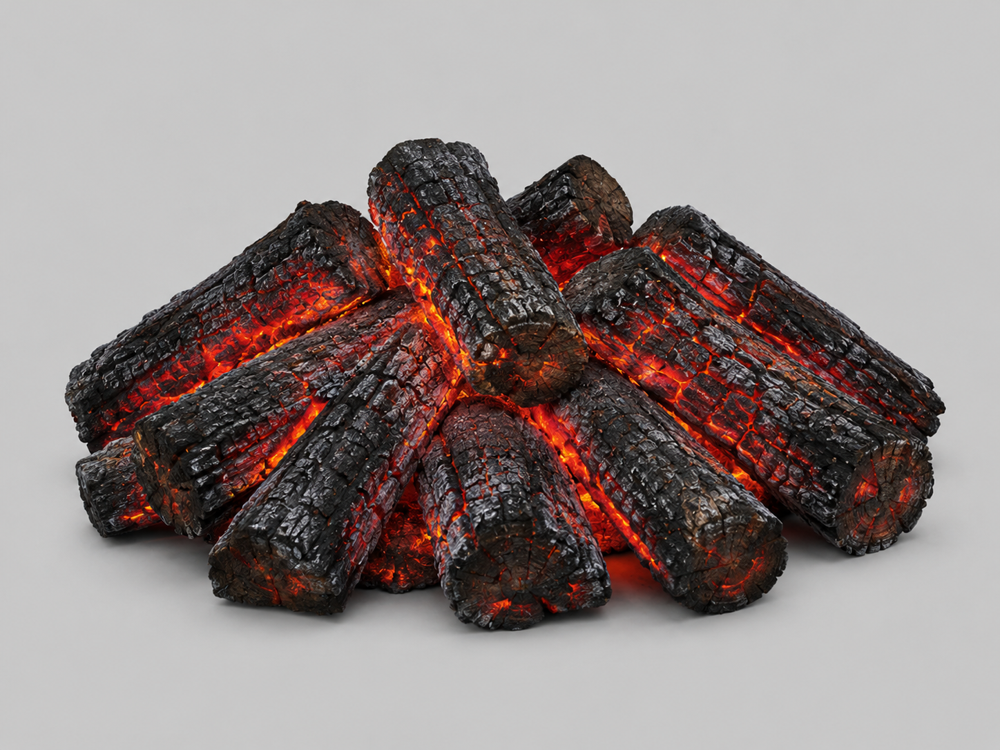

# Props and Building Assets

## Furniture

- bed.glb https://sketchfab.com/3d-models/old-wooden-bed-frame-and-dirty-sheets-79c856755e6a44a3bcf19671e5c70d2d

## Objects

- stone bridge https://sketchfab.com/3d-models/stone-bridge-a5d380cd08654b508b4b643056038605
- bridge wood https://sketchfab.com/3d-models/bridge-wood-20c090db0a7345898e20e2621fc2ba4c
- big bridge https://sketchfab.com/3d-models/bridge-9328bbfc04a84202a6a97bd59408473a
- bridge_wood_long.glb https://sketchfab.com/3d-models/wooden-bridge-deep-27b22af7020c4755b5cb788d75db8ee7
- signpost.glb https://sketchfab.com/3d-models/road-sign-blacksmiths-workshop-assets-3a230f0520034890931c32539955223a
- dungeon objects https://sketchfab.com/3d-models/fps-dungeon-extras-87425249dded42aa891516c31a5b94cf
- coin_pile_spill.glb https://sketchfab.com/3d-models/coins-7367feabcd4c4b30a7ba64b95b76bee0 (Blender에서 수정 + 쏟아짐 애니메이션 추가; 던전 체스트가 떨어뜨리는 줍기 코인). 아이콘 `client/public/items/coin_pile.png`는 이 GLB를 Blender 헤드리스로 임포트해 스필 마지막 프레임(35)에서 흩어진 코인 28개를 중앙 더미로 다시 모은 뒤 Cycles 직교 측면·위 각도 렌더 512²→128² (2026-08-13). coin_pile은 주우면 지갑으로 바로 들어가 인벤토리를 거치지 않으므로 이 아이콘이 실제로 표시되는 경로는 없음 — 완결성용
- torch_wall.glb https://sketchfab.com/3d-models/torch-238cd6056e2940debb4f67fc24c6df35 (던전 벽에 붙이는 토치)
- healing potion https://sketchfab.com/3d-models/low-poly-health-potion-dca8a2144a1446fe8391f54cc5f6959e
- scroll https://sketchfab.com/3d-models/scroll-7450e494eb654e9b937bb52724220e77 (scroll_enchant.glb는 같은 모델의 파란 봉인 변형. 소스는 ~/assets_original/scroll.blend (레포 밖 보관) — 두 머티리얼 모두 알파에 Math/ROUND 노드가 들어 있어 glTF 익스포트 시 alphaMode=MASK가 됨. 이 노드를 지우면 BLEND로 나가 봉인이 떠 보이는 문제가 재발하니 유지할 것. scroll_enchant_armor.glb는 scroll_enchant.glb의 알베도만 hue-rotation(파란 봉인 → 초록, -0.27 회전 + 명도 0.8배)해 GLB 바이너리에 되박은 초록 봉인 변형 — 메시·노멀·러프니스와 alphaMode=MASK는 그대로다, 스크립트, 2026-08-15)
- river rock https://sketchfab.com/3d-models/river-rocks-model-2dc354c1f84a43f493343f54e05eaed9
- campfire.glb — Meshy AI "Crimson Ember Stack" (Pro 요금제, 2026-08-02 생성). Meshy 유닛큐브를 지름 0.6m로 스케일 적용, 원점을 바닥 중앙으로 이동. 텍스처 2048→512 축소, metallic 맵은 전부 0이라 제거하고 metallicFactor=0. emissive는 잔불 발광이라 유지
- black_market_table.glb — Meshy AI "Bottles and Scrolls" (Pro 요금제, 2026-08-09 생성, 소스 `assets/Meshy_AI_Bottles_and_Scrolls_o_0809151940_texture.glb`). 완전 소유권·상업 OK (characters.md License 참조). 암시장 상인이 앞에 펼쳐 놓는 매대 — 병·두루마리·빵·상자가 놓인 좌판형 테이블. Blender에서 기존 table.glb(W 1.6m) 기준 너비 1.6m로 스케일 적용(1.60×0.96×0.89 W×H×D), 원점=바닥 중심, 텍스처 2048→512 축소, 검은 emissive 제거 (2026-08-10). 상인 `/lay_stall` 좌판으로 사용 (GameSceneStallsLayer)
    - 원화는 ChatGPT 이미지 생성 (ChatGPT Pro 20x, 2026-08-09) 
    - 원화는 ChatGPT 이미지 생성 (ChatGPT Pro 20x, 2026-08-03) 

## House

Poly Haven에서 받은 .gltf를 Blender에서 .glb로 다시 export

- wood_planks_1k.glb -> https://polyhaven.com/a/wood_planks
- planks_brown_10_1k.glb -> https://polyhaven.com/a/planks_brown_10
- dark_wooden_planks_1k.glb -> https://polyhaven.com/a/dark_wooden_planks
- marble_01_1k.glb -> https://polyhaven.com/a/marble_01
- weathered_planks_1k.glb -> https://polyhaven.com/a/weathered_planks
- wood_trunk_wall_1k.glb -> https://polyhaven.com/a/wood_trunk_wall
- wood_shutter_1k.glb -> https://polyhaven.com/a/wood_shutter
- wood_plank_wall_1k.glb -> https://polyhaven.com/a/wood_plank_wall
- clay_roof_tiles_02_1k.glb -> https://polyhaven.com/a/clay_roof_tiles_02
- clay_roof_tiles_03_1k.glb -> https://polyhaven.com/a/clay_roof_tiles_03
- grey_roof_tiles_02_1k.glb -> https://polyhaven.com/a/grey_roof_tiles_02
- medieval_blocks_03_1k.glb -> https://polyhaven.com/a/medieval_blocks_03
- red_brick_1k.glb -> https://polyhaven.com/a/red_brick
- reed_roof_03_1k.glb -> https://polyhaven.com/a/reed_roof_03
- sandstone_blocks_04_1k.glb -> https://polyhaven.com/a/sandstone_blocks_04
- worn_mossy_plasterwall_1k.glb -> https://polyhaven.com/a/worn_mossy_plasterwall
- beige_wall_001.glb -> https://polyhaven.com/a/beige_wall_001
- rough_linen.glb -> https://polyhaven.com/a/rough_linen
- wooden_garage_door_1k.glb -> https://polyhaven.com/a/wooden_garage_door (던전 입구 문)
- grey_stone_path_1k.glb -> https://polyhaven.com/a/grey_stone_path (던전 바닥/계단)

## Dungeon Textures

Poly Haven 벽 텍스처. `rock_wall_10`만 배선됨 (`housing-textures.ts`).

- rock_wall_10 https://polyhaven.com/a/rock_wall_10 — 던전 복도 벽 (사용 중, CC0)
- damaged_plaster — **[미사용]**
- old_stone_wall — **[미사용]**
- plaster_stone_wall_02 — **[미사용]**
- rabdentse_ruins_wall — **[미사용]**
- rock_wall_05 — **[미사용]**
- rock_wall_08 — **[미사용]**
- rock_wall_13 — **[미사용]**
- rustic_stone_wall — **[미사용]**

## Research

Not used right now, but for future reference.

- Procedural Northern European French Town in Geometry nodes Blender 5.0 — **[미사용]** 참고용, 아직 미도입
  https://github.com/IRCSS/Blender-Geometry-Node-French-Houses
